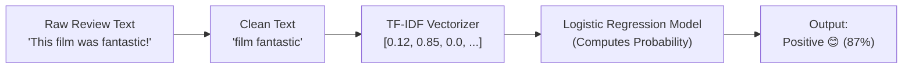

# 🎓 Beginner's Complete Workflow & Conceptual Guide
## IMDb Movie Reviews Sentiment Analysis

> **Who is this guide for?**  
> If you are new to Machine Learning (ML) and Natural Language Processing (NLP), this guide explains **every concept, equation, file, and step** in simple, plain English. You can use this to understand your project completely, prepare for your lab viva, or present it to your teacher.

---

## 📑 Table of Contents
1. [The Big Picture: What is Sentiment Analysis?](#1-the-big-picture-what-is-sentiment-analysis)
2. [The 5-Stage ML Pipeline (How It Works)](#2-the-5-stage-ml-pipeline-how-it-works)
   - [Stage 1: The Dataset](#stage-1-the-dataset)
   - [Stage 2: Text Preprocessing (Cleaning)](#stage-2-text-preprocessing-cleaning)
   - [Stage 3: TF-IDF Feature Extraction (Converting Words to Numbers)](#stage-3-tf-idf-feature-extraction-converting-words-to-numbers)
   - [Stage 4: Model Training (Logistic Regression)](#stage-4-model-training-logistic-regression)
   - [Stage 5: Evaluation & Metrics](#stage-5-evaluation--metrics)
3. [File-by-File Breakdown](#3-file-by-file-breakdown)
4. [How the Web App (Streamlit) Works](#4-how-the-web-app-streamlit-works)
5. [Viva & Teacher Defense Cheat Sheet (Q&A)](#5-viva--teacher-defense-cheat-sheet-qa)

---

## 1. The Big Picture: What is Sentiment Analysis?

Computers do not understand human feelings or text directly; they only understand numbers.  
**Sentiment Analysis** is the process of taking written human text (like a movie review) and training a mathematical model to classify the underlying attitude as **Positive (1)** or **Negative (0)**.



---

## 2. The 5-Stage ML Pipeline (How It Works)

### Stage 1: The Dataset
* **Dataset Used:** The IMDb 50,000 Movie Reviews Dataset.
* **Size:** 50,000 labeled reviews (25,000 Positive, 25,000 Negative).
* **Why it matters:** Because the dataset is perfectly **balanced** (50% positive, 50% negative), the model doesn't develop an unfair bias toward one class.
* **Train / Test Split:**
  - **40,000 reviews (80%)** are used to **train** (teach) the model.
  - **10,000 reviews (20%)** are kept hidden as the **test set** to evaluate the model on reviews it has never seen before.

---

### Stage 2: Text Preprocessing (Cleaning)
Located in [`src/preprocessor.py`](file:///home/iamaraf/Programming%20%5BGithub%5D/Compiler/sentiment_analysis/src/preprocessor.py).

Raw text from websites is messy. If we don't clean it, our model gets confused. We perform 4 cleaning steps:

1. **Remove HTML tags:** Web reviews often contain `<br />` or `<div>`. We use regex `re.sub(r'<.*?>', ' ', text)` to remove them.
2. **Remove URLs:** Strings like `https://example.com` don't convey sentiment.
3. **Lowercase everything:** To a computer, `"Great"` and `"great"` look like two completely different words. Converting everything to lowercase ensures they are treated as the same word.
4. **Remove punctuation & special characters:** Symbols like `!`, `@`, `#`, `$` are stripped, keeping only alphabetic letters `a-z`.

**Example:**
* *Before:* `<br />This movie was simply AMAZING!!! 10/10. https://imdb.com`
* *After:* `this movie was simply amazing`

---

### Stage 3: TF-IDF Feature Extraction (Converting Words to Numbers)

Machine learning models cannot take raw strings as input. We must convert text into a matrix of numbers.

Instead of just counting how many times a word appears (**Count Vectorizer**), we use **TF-IDF (Term Frequency - Inverse Document Frequency)**.

#### Why TF-IDF is smarter than simple word counting:
Common words like `"the"`, `"is"`, and `"movie"` appear in almost every single review. If we only counted words, these words would dominate, even though they tell us **nothing** about whether the movie was good or bad!

TF-IDF solves this by giving:
* **High weight** to words that are frequent in *one specific review* but rare across the entire dataset (e.g., `"breathtaking"`, `"masterpiece"`, `"horrendous"`, `"unbearable"`).
* **Low weight** to common words that appear everywhere (e.g., `"movie"`, `"film"`, `"the"`).

#### The Math in Simple Terms:
$$\text{TF-IDF} = \text{TF} \times \text{IDF}$$

1. **Term Frequency (TF):** How often word $w$ appears in review $d$:
   $$\text{TF}(w, d) = \frac{\text{Count of } w \text{ in } d}{\text{Total words in } d}$$
2. **Inverse Document Frequency (IDF):** Penalizes words that appear everywhere:
   $$\text{IDF}(w) = \ln\left(\frac{\text{Total Reviews}}{\text{Reviews containing } w}\right)$$

#### N-Grams (Unigrams + Bigrams):
We configure `ngram_range=(1, 2)`.
* **Unigram (1 word):** `"good"`, `"bad"`
* **Bigram (2 consecutive words):** `"not good"`, `"waste time"`  
* **Why this matters:** A unigram model might see `"good"` in `"not good"` and mistake it for positive. Bigrams preserve context!

---

### Stage 4: Model Training (Logistic Regression)
Located in [`src/train.py`](file:///home/iamaraf/Programming%20%5BGithub%5D/Compiler/sentiment_analysis/src/train.py).

Despite its name containing "Regression", **Logistic Regression is a classification algorithm**.

1. It assigns a mathematical **weight ($w$)** to each word:
   - Positive words like `"masterpiece"`, `"brilliant"`, `"superb"` get **positive weights** ($+2.5$).
   - Negative words like `"worst"`, `"waste"`, `"awful"` get **negative weights** ($-3.1$).
   - Neutral words get weights close to $0.0$.
2. For any review, it calculates the sum of all word weights: $z = w_1 x_1 + w_2 x_2 + \dots + b$.
3. It passes $z$ into the **Sigmoid function** $\sigma(z) = \frac{1}{1 + e^{-z}}$, which squashes any number into a probability between **0% and 100%**:
   - If probability $\ge 50\% \implies$ **Positive Sentiment 😊**
   - If probability $< 50\% \implies$ **Negative Sentiment 😞**

---

### Stage 5: Evaluation & Metrics

When tested on **10,000 unseen reviews**, the model achieved **89.43% accuracy**.

#### The Evaluation Metrics Explained:
* **Accuracy (89.43%):** Out of 10,000 test reviews, the model classified ~8,943 correctly.
* **Precision (0.90 for Negative, 0.89 for Positive):** When the model predicts a review is positive, it is right 89% of the time.
* **Recall (0.89 for Negative, 0.90 for Positive):** Out of all actual positive reviews in the test set, the model successfully caught 90% of them.
* **F1-Score (0.89):** The harmonic mean of precision and recall (balanced indicator).

#### The Confusion Matrix:
A 2x2 grid showing exact counts:
- **True Positives (TP):** Actually positive $\rightarrow$ Predicted positive (4,507)
- **True Negatives (TN):** Actually negative $\rightarrow$ Predicted negative (4,436)
- **False Positives (FP):** Actually negative $\rightarrow$ Predicted positive (564)
- **False Negatives (FN):** Actually positive $\rightarrow$ Predicted negative (493)

---

## 3. File-by-File Breakdown

```
Compiler/sentiment_analysis/
│
├── data/
│   ├── sample_reviews.csv       --> Small offline dataset for fast testing
│   └── download_dataset.py      --> Downloads & loads the 50,000 IMDb dataset
│
├── models/
│   ├── sentiment_model.pkl      --> Saved trained Logistic Regression model
│   ├── tfidf_vectorizer.pkl     --> Saved vocabulary & TF-IDF weights
│   └── confusion_matrix.png     --> Evaluation visualization chart
│
├── src/
│   ├── preprocessor.py          --> Cleans raw text (removes HTML, lowercase, regex)
│   ├── train.py                 --> Preprocesses data, trains ML model, saves metrics & .pkl files
│   └── predict.py               --> Quick terminal tool to test custom sentences
│
├── app.py                       --> Interactive web interface using Streamlit
├── Sentiment_Analysis_Project.ipynb --> Complete Jupyter Notebook for lab presentation
├── requirements.txt             --> List of all Python packages required
├── README.md                    --> Formal academic project report
└── STUDENT_WORKFLOW_GUIDE.md    --> This complete guide
```

---

## 4. How the Web App (Streamlit) Works

When you run:
```bash
streamlit run app.py
```
1. Streamlit spins up a local web server at `http://localhost:8501`.
2. `app.py` loads the pre-trained `sentiment_model.pkl` and `tfidf_vectorizer.pkl`.
3. When you type a sentence and click **Analyze Sentiment**:
   - It runs your sentence through `clean_text()`.
   - Converts it into TF-IDF numerical vector.
   - Calls `model.predict_proba()`.
   - Displays the sentiment badge, confidence percentage, and probability distribution bar chart.

---

## 5. Viva & Teacher Defense Cheat Sheet (Q&A)

If your teacher or lab examiner asks you questions, here are simple, crisp answers:

#### Q1: "Why did you choose TF-IDF instead of simple CountVectorizer (Bag of Words)?"
> *"CountVectorizer only counts word frequencies, giving high weights to common but uninformative words like 'the' or 'movie'. TF-IDF scales down universally frequent words and gives higher importance to distinct sentiment-carrying words like 'superb' or 'terrible'."*

#### Q2: "Why use Logistic Regression instead of Deep Learning (like LSTM or BERT)?"
> *"For text classification with TF-IDF features, Logistic Regression trains in seconds, has a very small memory footprint (~2MB model file), is highly interpretable, and achieves strong baseline accuracy (89.43%) without requiring expensive GPUs."*

#### Q3: "How does your model handle phrases like 'not good' vs 'good'?"
> *"We configured the TF-IDF vectorizer with `ngram_range=(1, 2)`. This extracts both single words (unigrams) and pairs of adjacent words (bigrams), allowing the model to capture the negative context of 'not good' separately from 'good'."*

#### Q4: "Why did you use Stratified Train-Test split?"
> *"Stratified splitting ensures that both the training set (80%) and test set (20%) have an exact 50/50 balance of positive and negative reviews, preventing distribution skew."*

#### Q5: "What are the limitations of this model?"
> *"Traditional ML with TF-IDF does not fully understand sarcasm (e.g. 'Oh wonderful, another plot hole!') or long-range sentence dependencies, which can be improved in future work using Transformer-based architectures like BERT."*

---

🎉 **You are now ready to demonstrate, run, and explain this project with full confidence!**
